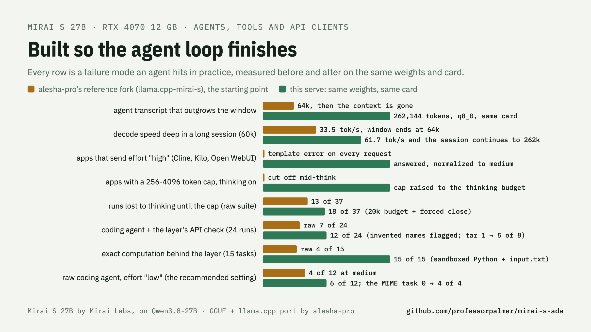
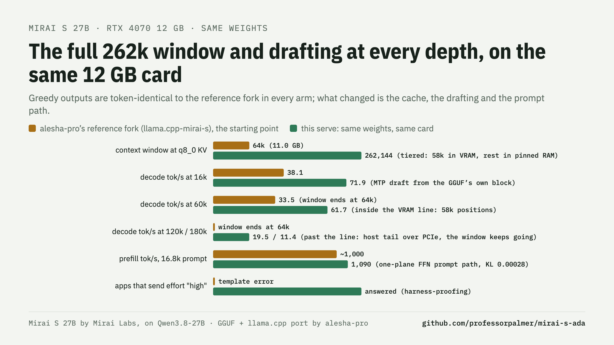
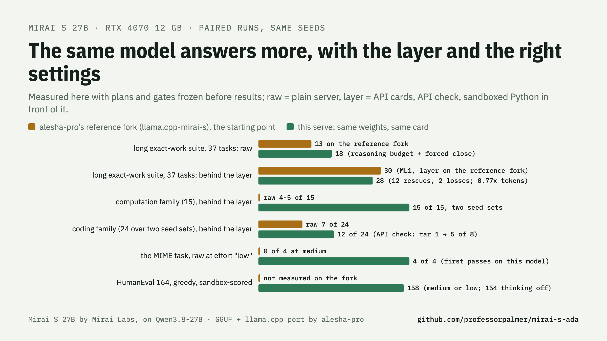

# Mirai S 27B on a 12 GB card: the full 262k window, drafting at every depth, and the layer

This repository serves Mirai S 27B on one RTX 4070 with 12 GB of VRAM.

[Mirai S](https://huggingface.co/trymirai/Qwen3.8-27B-S-experimental) is a version of Qwen3.8-27B from
[Mirai Labs](https://trymirai.com). Mirai Labs compressed the model with their trellis codec to approximately 2.4 bits
of information for each weight. alesha-pro converted the model to
[GGUF](https://huggingface.co/alesha-pro/Qwen3.8-27B-S-mirai-GGUF) (11.17 GB) and ported the Mirai S codec to
llama.cpp.

This serve adds these items:

- The **full 262,144-token trained window with a q8_0 KV cache**.
- **MTP speculative decoding at every depth**. The draft block is in the GGUF.
- **Harness-proofing** for apps that send `effort: "high"` or very small output caps.
- An optional **server-side layer**: exact API cards, an API check and a sandboxed Python tool.

The weights are the same as the published weights. Before all other measurements, this project checked each kernel
against alesha-pro's reference fork, greedy and token for token. This repository does not replace the work of Mirai
Labs or alesha-pro. It is a serving layer on that work: it adds the cache, the drafting, the server flags and the
measurements that a 12 GB card needs.

## Who made what

| Contribution | By |
| --- | --- |
| The model [`Qwen3.8-27B-S-experimental`](https://huggingface.co/trymirai/Qwen3.8-27B-S-experimental), the Mirai S trellis codec and the vLLM plugin with the original CUDA kernels | [Mirai Labs](https://trymirai.com) |
| The base model [Qwen3.8-27B](https://huggingface.co/Qwen/Qwen3.8-27B) and the vision encoder | Qwen (Alibaba) |
| The GGUF conversion, [`Qwen3.8-27B-S-mirai-GGUF`](https://huggingface.co/alesha-pro/Qwen3.8-27B-S-mirai-GGUF). The trellis codes are copied bit for bit. | [alesha-pro](https://github.com/alesha-pro) |
| The port of the Mirai S codec to llama.cpp and ggml (types 90-93, CPU and CUDA kernels), in the reference fork [`llama.cpp-mirai-s`](https://github.com/alesha-pro/llama.cpp-mirai-s). This serve started from that fork and checks its outputs against it. | alesha-pro |
| The refusal-direction control vector and the `--cvec-mode project` engine mode (refer to [Remove refusals](#remove-refusals-optional-from-alesha-pro)) | alesha-pro |
| The Linux launcher `start-server.sh` and the Linux check on an RTX 3090 (refer to [Quick start (Linux)](#quick-start-linux-from-alesha-pro)) | alesha-pro |
| The llama.cpp fork that the engine uses | [PrismML](https://github.com/PrismML-Eng/llama.cpp) |
| The planar activation layout and the batch-invariant mode ([PrismML PR #218](https://github.com/PrismML-Eng/llama.cpp/pull/218), in the engine with the original authorship) | [sudoingX](https://github.com/sudoingX) |
| llama.cpp and ggml | the ggml authors ([ggml-org](https://github.com/ggml-org/llama.cpp)) |
| The optional DFlash drafter, [`ggml-org/Qwen3.8-27B-GGUF`](https://huggingface.co/ggml-org/Qwen3.8-27B-GGUF) | ggml-org |
| The tiered KV cache, drafting at every depth, harness-proofing, the prefill work, the launcher for Windows, the layer, the suite and the measurements | Cary Palmer (this repository) |

## Results

The table compares alesha-pro's reference fork with this serve. Both ran on the same RTX 4070 12 GB with one slot.

| RTX 4070 12 GB, served, one slot | alesha-pro's reference fork (`llama.cpp-mirai-s`, the starting point) | this serve |
| --- | ---: | ---: |
| context window with q8_0 KV | 64k (11.0 GB) | **262,144** (tiered: approximately 58k positions in VRAM, the remainder in pinned RAM) |
| decode, tok/s, at 0 / 16k / 60k / 120k / 180k | 40.0 / 38.1 / 33.5 (60k) / - / - | **76.6 / 72.6 / 61.7 / 19.5 / 11.4** (60k is inside the VRAM line since the evening of 10-06; before that, 40.3) |
| prefill, 16.8k-token prompt | approximately 1,000 | **1,090** (2048 micro-batch mode: 1,148) |
| speculative decoding | none | MTP draft at every depth, outputs identical to drafting off |
| HumanEval 164, greedy, tests run in a sandbox | | **158** at medium or at effort "low"; 154 with thinking off |
| long exact-work suite, 37 tasks, raw / through the layer | 13 / 30 (on the reference fork) | **18 / 28** (12 rescues, 2 losses); coding family over two seed sets 7 / **12** of 24, at effort "low" 6 / 8 of 12 |
| apps that send `effort: "high"` | template error on each request | answered (changed to medium) |

The receipts for each row are in `receipts/mirai-port/` and `bench/`. `docs/REPORT.md` and `docs/PREFILL.md` tell how
this project got each number and what did not work. The numbers are from 2026-10-05 and 2026-10-06. The
decode-by-depth numbers are from the evening of 10-06 (`receipts/mirai-port/decode_by_depth.log`). The GDDR6X memory
was at stock clocks. The display was on the integrated GPU of the CPU (refer to
[Get more positions into VRAM](#get-more-positions-into-vram)).



## Quick start (Windows, NVIDIA)

1. Download `mirai-s-bundle-win-x64.zip` from [Releases](../../releases). Unzip it into this repository. It fills
   `bin\`. You can also build the binaries (refer to [Build from source (Windows)](#build-from-source-windows)).
   The binaries contain sm_89 machine code (RTX 40). They need only the NVIDIA driver.
2. Download `Qwen3.8-27B-S-mirai.gguf` from [alesha-pro on Hugging Face](https://huggingface.co/alesha-pro/Qwen3.8-27B-S-mirai-GGUF).
   Put it in `models\`. The MTP draft block is in that file. This project does not graft a draft block.
3. Optional: make a copy of the GGUF with a smaller draft block. This step takes approximately two minutes on the CPU.
   It needs `numpy` and the `engine` submodule, or `pip install gguf`.

   ```powershell
   python tooling\requant_mtp.py models\Qwen3.8-27B-S-mirai.gguf models\Qwen3.8-27B-S-mirai-mtpq4.gguf
   ```

   The script requantizes only the MTP draft block, from Q8_0 to Q4_0. All other tensors stay byte-identical. When
   the copy is present, the launcher uses it. The copy gives 204 MiB more K/V in VRAM (approximately 6k positions).
   The outputs are identical by construction, because speculation is exact. The draft acceptance is 77.7% against
   78.2% (`receipts/mirai-port/mtp_q4_probe.log`).
4. Optional, one time: run `layer\fetch_runtime.ps1`. The script downloads the sandbox runtime (CPython 3.12 on WASI,
   with checksums) and runs its isolation canaries. Without the runtime, the plain server starts.
5. Start the server:

   ```powershell
   .\start-server.ps1
   ```

   The server gives an OpenAI-compatible API on `http://<host>:8080/v1`. The bearer key is in
   `artifacts\api_key.txt`. The launcher makes this file on the first run.

   The launcher reads the free VRAM. It keeps a safety margin below the point where Windows demotes the memory of a
   background process. Then it puts as many positions of the 262k cache in VRAM as possible. On this card, that is
   57,856 positions headless with the Q4 draft-block copy, and approximately 51k with the published file. The
   launcher prints the line that it chose.




## Quick start (Linux, from alesha-pro)

alesha-pro wrote the Linux launcher, `start-server.sh`. alesha-pro also checked this procedure on Ubuntu 22.04 with an
RTX 3090, the CUDA 12.8 toolkit, gcc 11.4 and cmake 3.22 (`receipts/ubuntu-3090/`).

```bash
git clone --recurse-submodules https://github.com/professorpalmer/mirai-s-ada && cd mirai-s-ada
cmake -S engine -B build -DCMAKE_BUILD_TYPE=Release -DGGML_CUDA=ON -DLLAMA_CURL=OFF \
  -DCUDAToolkit_ROOT=/usr/local/cuda -DCMAKE_CUDA_COMPILER=/usr/local/cuda/bin/nvcc -DCMAKE_CUDA_ARCHITECTURES=86
cmake --build build -j --target llama-server            # approximately 4 min on 32 threads
hf download alesha-pro/Qwen3.8-27B-S-mirai-GGUF --local-dir models
MIRAI_KV_VRAM_CELLS=44000 ./start-server.sh             # raw server on http://127.0.0.1:8080/v1
```

- Set both CUDA paths to a CUDA 12 or 13 toolkit. On the test computer, an older system `nvcc` was first on the
  PATH. Without the compiler path, the configure step failed.
- With a system cuBLAS 11, the int8 GEMM of the prompt path uses a tile that is approximately half as fast.
- Set `CMAKE_CUDA_ARCHITECTURES` to your GPU generation: 86 for RTX 30, 89 for RTX 40. Without it, an older cmake
  builds the kernels for all generations. That build took 17 minutes on the test computer.
- As a last check, a fresh clone of this branch was built with these steps and served through `start-server.sh`.

`start-server.sh` starts only the raw server. It uses the same flags and environment as `start-server.ps1`. It does
not start the layer, and it does not calculate the VRAM line. Set `MIRAI_KV_VRAM_CELLS` for your card. The
[knobs table](#knobs-environment-variables) applies. The script also reads `MIRAI_HOST`, `MIRAI_API_KEY`,
`MIRAI_MMPROJ` (images, with the encoder on the CPU) and `MIRAI_CVEC` (refer to
[Remove refusals](#remove-refusals-optional-from-alesha-pro)).

### Measurements on Linux, by alesha-pro

alesha-pro measured these results on the Ubuntu computer with the 12 GB recipe of the morning of 10-06. The recipe
used 44,000 positions in VRAM and the published GGUF. The card was at 300 W on PCIe 3.0 x16
(`receipts/ubuntu-3090/`).

| | Ubuntu 22.04, RTX 3090 |
| --- | ---: |
| greedy identity against the reference dumps, thinking off | 5 of 5 |
| thinking on (the 300-token reference is a prefix of the output) | 5 of 5 |
| VRAM at load / peak over a 180k-token prompt | 11,533 / 11,719 MiB |
| decode, tok/s, at 8k / 60k / 120k / 180k | 66.9 / 27.9 / 9.5 / 5.8 |
| prefill, 8k-token prompt | 1,124 tok/s |
| MTP draft acceptance, thinking off / on | 71% / 65% |

Past the VRAM line, this computer is slower than the RTX 4070. At 60k, it decoded 27.9 tok/s. The RTX 4070 decoded
40.3 tok/s at 60k when its line was also at 44-45k. Now the RTX 4070 keeps 60k inside the line (refer to the
[Results](#results) table). This computer reads the tail over PCIe 3.0. That is the probable cause, but this project
did not isolate it.

These numbers come from one `llama-server` command line:

```bash
llama-server -m Qwen3.8-27B-S-mirai.gguf -ngl 99 -fa on -c 262144 -np 1 -ctk q8_0 -ctv q8_0 --kv-vram-cells 44000 \
  -b 2048 -ub 1024 --kq-mask-packed \
  --spec-type draft-mtp --spec-draft-n-max 2 --spec-draft-n-max-tail 2 --spec-draft-window 16384 -ctkd q8_0 -ctvd q8_0 \
  --reasoning-effort-allow medium --reasoning-max-tokens-floor 24576 --reasoning-budget 20480 --backend-sampling \
  --chat-template-file templates/bonsai-template.jinja --chat-template-kwargs '{"reasoning_effort":"medium"}' --jinja
```

The environment also has `GGML_CUDA_BATCH_INVARIANT=1` and `GGML_MIRAI_PREFILL_PLANES=ffn`. `start-server.sh` sets
both.

## Remove refusals (optional, from alesha-pro)

alesha-pro measured the refusal direction of the quantized model. alesha-pro published this direction as a 1.3 MB
control vector next to the weights. The engine can remove the direction from the residual stream at run time with
`--cvec-mode project`. alesha-pro also wrote this engine mode.

1. Download the vector:

   ```bash
   hf download alesha-pro/Qwen3.8-27B-S-mirai-GGUF Qwen3.8-27B-S-mirai-refusal-direction.gguf --local-dir models
   ```

2. Add two arguments to the `llama-server` command line:

   ```bash
   --control-vector-scaled models/Qwen3.8-27B-S-mirai-refusal-direction.gguf:1.0 --cvec-mode project
   ```

   On Linux, you can set `MIRAI_CVEC` instead:
   `MIRAI_CVEC=models/Qwen3.8-27B-S-mirai-refusal-direction.gguf ./start-server.sh`. `start-server.ps1` does not
   pass these arguments yet.

[`docs/CONTROL-VECTOR.md`](docs/CONTROL-VECTOR.md) has the measurements, the method and the caveats of alesha-pro. It
also tells what this repository checked and did not check with the vector. The vector is off if you do not give the
file. This project did not measure the vector on the suite.

## Recommended settings

- **Chat, coding answers and all requests through the layer**: use the defaults (medium reasoning, 20k thinking
  budget, layer on).
- **Coding agents that run their own tools** (Cline, Kilo, OpenHands-style loops against `127.0.0.1:18080`, or the
  layer with `"api_cards": false`): send `reasoning_effort: "low"`. Start the server with
  `MIRAI_EFFORT_ALLOWED=low,medium`, so that the server accepts that value. On the coding family of the suite, raw,
  with the same seeds, the result went from 4 to 6 of 12. The MIME task went from 0 to 4 of 4. HumanEval stayed at
  158/164. The cost is longer tool loops (+31% completion tokens).
- **Sessions that stay below approximately 28k tokens and need the fastest decode**: set `MIRAI_SPEC_TYPE=dflash`.
  Put the Q4_0 DFlash drafter from `ggml-org/Qwen3.8-27B-GGUF` in `models\`. Results (E22, three runs): 86 / 78
  tok/s at 0 / 16k, against 76 / 72 with the MTP block. The greedy outputs are identical, and the acceptance is 70% at
  draft 3. Drafts of 4 or more are slower. The drafter uses approximately 17k of the approximately 58k positions in
  VRAM. For this reason, the default keeps the MTP block for long agent sessions.
- **Tool-heavy agents that need speed more than depth**: send `chat_template_kwargs: {"enable_thinking": false}` in
  each request (HumanEval 154/164 at 0.19x the tokens).

## Knobs (environment variables)

| Variable | Default | Function |
| --- | --- | --- |
| `MIRAI_CTX` | 262144 | context window |
| `MIRAI_CTK` | q8_0 | K/V cache type |
| `MIRAI_TIER` | 1 | 0 = all-VRAM cache (then a 64k window) |
| `MIRAI_KV_VRAM_CELLS` | auto | sets a fixed VRAM line |
| `MIRAI_VRAM_MARGIN` | 800 headless, 1300 with the display on this card | MiB that stay free below the demotion point |
| `MIRAI_SPEC` / `MIRAI_SPEC_DEEP` | 2 / 2 (3 with dflash) | draft size, and draft size past the VRAM line |
| `MIRAI_SPEC_TYPE` / `MIRAI_DRAFTER` | mtp / `models\dflash-Qwen3.8-27B-Q4_0.gguf` | `dflash` drafts with the DFlash drafter of ggml-org, not with the MTP block of the GGUF: +13% decode at depth 0, +8.5% at 16k, outputs identical, approximately 590 MiB more VRAM (approximately 17k fewer positions in VRAM). Download the drafter from `ggml-org/Qwen3.8-27B-GGUF` into `models\` |
| `MIRAI_DRAFT_WINDOW` | 16384 | rows that the draft block keeps |
| `MIRAI_EFFORT` / `MIRAI_EFFORT_ALLOWED` | medium / medium | default effort of the server; effort words that the template gets (the server changes other words to medium) |
| `MIRAI_THINK` / `MIRAI_THINK_BUDGET` | 1 / 20480 | thinking on; tokens before a forced close |
| `MIRAI_HARNESS_PROOF` | 1 | 0 = do not change effort words and output caps |
| `MIRAI_PREFILL_PLANES` | ffn | numerics for prompt tokens: `ffn` (one int8 plane for the FFN matmuls, +18% prefill, KL 0.00028), `2` exact, `1` one plane for all matmuls |
| `MIRAI_KQ_MASK_PACKED` / `MIRAI_UBATCH` | 1 / 1024 | 1-bit attention mask; micro-batch (2048 = +5.6% prefill for approximately 570 MiB of VRAM) |
| `MIRAI_LEVELS_MIB` | 128 | memory size of the level-decode chunk for long prompts |
| `MIRAI_SHARED_POOL` | 1 | one transient CUDA pool for the target and draft contexts, with a 256-token draft micro-batch: gives back 188 MiB of VRAM (approximately 5.7k positions); outputs, decode and acceptance do not change (E23); 0 disables it |
| `MIRAI_LAYER` | 1 | 0 = no layer |
| `MIRAI_STDERR_FILE` / `MIRAI_RESTARTS` | none / 3 | file that keeps the raw stderr of the server (assert text); number of restarts after an abort before the launcher stops |
| `MIRAI_PORT`, `MIRAI_MODEL`, `MIRAI_LOG_FILE` | 8080, auto, none | model: `models\Qwen3.8-27B-S-mirai-mtpq4.gguf` if present, else the published file |

### Get more positions into VRAM

Each GB of VRAM that the desktop does not use gives approximately 30k more q8_0 positions at full speed. To get this
VRAM:

1. Connect the display to the integrated graphics of the CPU.
2. In Windows, open **Settings > System > Display > Graphics**. Set the GPU-accelerated apps to the integrated
   graphics.

The launcher margin then decreases from 1300 MiB to 800 MiB headless.

### Why the VRAM line is approximately 58k and not more

- Mirai keeps 8,016 MiB of weights in VRAM. With the published file, it keeps 8,220 MiB, because the MTP draft block
  at Q8_0 is 204 MiB larger than the Q4_0 copy.
- Drafting keeps one 150 MiB snapshot of the recurrent state for each unit of rollback depth. At the default draft of
  2, that is two snapshots.
- The draft context uses approximately 480 MiB when it shares the transient pool.
- Each q8_0 position uses 34,816 bytes. Thus each 100 MiB holds approximately 3k positions.

Past the line, each step reads the host tail over PCIe. In that range, drafting gives 2.2x the speed of no drafting.
`MIRAI_SPEC=0` moves the line to approximately 80k positions. But below the line, you then lose the 1.85x gain from
drafting (`docs/REPORT.md`, sections 5b and 6e).

## Known limits and issues

- **12 GB is the minimum.** 8.2 GB of weights stay in VRAM. This model does not fit on an 8 GB card, and the launcher
  does not try.
- **Past the VRAM line, the PCIe speed limits the decode.** The line is at approximately 58k positions on a 12 GB
  card with the display on the iGPU (refer to the [Results](#results) table). The launcher calculates that a 16 GB
  card moves the line to approximately 180k. This project did not measure that.
- **Prefill is at the int8 limit of the card.** The trellis level decode and the int8 GEMM run at 191-233 TOPS of the
  233 TOPS dense peak. Approximately 1.1k tok/s on a 16.8k prompt is the speed of this card with these weights. An
  overlap of the level decode behind the GEMM gave 0 to -2.5% (`docs/PREFILL.md`). Each of the remaining options
  gives only a few percent.
- **The K/V cache stays at q8_0.** A q4_0 cache (`MIRAI_CTK=q4_0`) puts approximately two times the positions in
  VRAM. This project did not measure its quality cost on this model. Thus it is a knob and not a default.
- **Host RAM**: the full 262k cache keeps approximately 7 GB of K/V in pinned system RAM. The computer must have that
  much free RAM.
- **One slot** (`-np 1`). The reference fork also requires one slot for this model.
- **Two launchers.** `start-server.ps1` (Windows) calculates the VRAM line and starts the layer. `start-server.sh`
  (Linux) starts the raw server with the line that you give. On Linux, the layer is not connected or tested.
- **The server changes effort words that are not on the allow-list to medium.** This is intentional
  (harness-proofing). Agents that need "low" must start the server with `MIRAI_EFFORT_ALLOWED=low,medium`. The server
  does not silently accept or reject the effort of a request. It maps the effort, and the server log records the
  change.
- **By default, prompt numerics use one plane for the FFN matmuls.** The KL against the exact path is 0.00028, the
  top-token agreement is 99.2%, and no suite pair changed. `MIRAI_PREFILL_PLANES=2` gives the exact path at -18%
  prefill.
- **Library-heavy coding tasks stay difficult for the model.** The MIME task of the suite passes only raw at effort
  "low". The API check of the layer decreases invented names. It does not remove the limits of the model.
- **Sampled runs are deterministic for an identical request and seed.** With cache reuse, a late divergence occurs
  rarely: one time in twelve traces of 70k characters. Treat small paired differences as noise (`docs/REPORT.md`,
  determinism probe).
- **One abort occurred one time and did not occur again.** On the evening of 10-06, a 180k-token request stopped
  llama-server with an assert-style fail-fast. Then four runs were clean: the same request, the same sequence of
  requests, and the bare server at 120k and 180k (`docs/REPORT.md` 6e). Now the launcher monitors the server:
  - It restarts an aborted server, up to `MIRAI_RESTARTS` times (default 3) in ten minutes.
  - It writes the event to its output.
  - With `MIRAI_STDERR_FILE=logs\product.stderr`, it keeps the raw stderr of the server. An assert prints its text
    there.
- To report an issue, attach the configuration block that the launcher prints and `logs\product.log`. If you set
  `MIRAI_STDERR_FILE`, also attach `logs\product.stderr`.

## Measure it yourself

Run these commands to repeat the measurements:

```powershell
python bench\compare_servers.py --base http://127.0.0.1:18080 --against receipts\mirai-port\stock-greedy-nothink.json   # greedy identity against alesha-pro's reference fork
bash bench\product_smoke.sh                                   # identity, layer round trip, decode by depth
bash bench\prefill_probe.sh                                   # prefill by prompt length
python suite\run_suite.py --base http://127.0.0.1:18080 --base-b http://127.0.0.1:8080 --out suite-out   # the paired suite
python bench\humaneval_wasi.py --arm medium                    # HumanEval 164, scored in a sandbox
python bench\determinism_probe.py                             # same request and seed, seven conditions
```

## What is here

| Path | Contents |
| --- | --- |
| `engine/` | Submodule: [`professorpalmer/llama.cpp-ada-mirai`](https://github.com/professorpalmer/llama.cpp-ada-mirai). The PrismML llama.cpp fork with these additions: the serving patches (tiered KV cache, draft window and tail, reasoning flags, batch-invariant kernels, op timing); the Mirai S codec as alesha-pro ported it to ggml (ggml types 90-93, CPU and CUDA kernels, rotation and scale tensors, split attention gate, graph hook); the prefill work of this project (one-plane FFN prompt numerics, packed 1-bit KQ mask, level-decode chunks). |
| `start-server.ps1` | The Windows launcher. It calculates the VRAM line from measured fixed costs and starts the layer in front of llama-server. |
| `start-server.sh` | The Linux launcher, from alesha-pro. It starts the raw server with the same flags. Optional: images (`MIRAI_MMPROJ`) and the refusal-direction vector (`MIRAI_CVEC`, `docs/CONTROL-VECTOR.md`). |
| `tooling/` | `build_engine.bat` (Ninja + pip CUDA 13, sm_89), `install_bin.ps1`, `serve.ps1` / `stop.ps1` (hidden test server, log and PID files). |
| `layer/`, `suite/` | The layer and the long exact-work suite, from [`bonsai-ada-surgery`](https://github.com/professorpalmer/bonsai-ada-surgery), with the changes of this project (`layer/ORIGIN.md`). |
| `bench/` | The measurement scripts, and the scoreboard and results of each run (`ML1`..`ML2f`, `E18`..`E21`, HumanEval arms). |
| `receipts/` | Small text receipts that the documents refer to: profiles, greedy dumps from alesha-pro's reference fork, probe logs. `ubuntu-3090/` is the Linux check of alesha-pro (RTX 3090). |
| `templates/bonsai-template.jinja` | The chat template for all measurements (reasoning_effort, thinking on/off). |
| `docs/REPORT.md`, `docs/PREFILL.md`, `docs/ROADMAP.md`, `docs/CONTROL-VECTOR.md` | The findings, the prefill investigation, the remaining work, and the run-time refusal removal of alesha-pro. |

## Build from source (Windows)

You need the C++ workload of VS 2022 Build Tools and the NVIDIA pip wheels. You do not need the CUDA toolkit. For
Linux, refer to [Quick start (Linux)](#quick-start-linux-from-alesha-pro).

```powershell
python -m pip install cmake ninja nvidia-cuda-nvcc nvidia-cuda-runtime nvidia-cublas nvidia-cuda-nvrtc
git clone --recurse-submodules https://github.com/professorpalmer/mirai-s-ada
cd mirai-s-ada
tooling\build_engine.bat llama-server      # approximately 30 min the first time
tooling\install_bin.ps1                      # copies the result into bin\ next to the CUDA runtime DLLs
```

## Licenses and attribution

- This repository (launcher, tooling, layer, suite, documents, receipts): MIT, Cary Palmer.
- The engine (`engine/`): llama.cpp is MIT (the ggml authors). The PrismML fork and the alesha-pro fork are also MIT.
  The engine tree keeps their notices. The Mirai S codec is the work of Mirai Labs. The ggml and CUDA kernels for the
  codec in the engine come from the port by alesha-pro. The commit history and `engine/README.md` record this
  attribution.
- This repository does not redistribute the model weights. The model is
  [`trymirai/Qwen3.8-27B-S-experimental`](https://huggingface.co/trymirai/Qwen3.8-27B-S-experimental) from Mirai Labs,
  a quantization of Qwen3.8-27B from Alibaba. `Qwen3.8-27B-S-mirai-GGUF` is the community conversion of that model by
  alesha-pro. Its license is on its Hugging Face card (Apache 2.0, the same as Qwen3.8). Download the GGUF from there
  and keep its notices.
- This project has no affiliation with Mirai Labs, alesha-pro, PrismML, sudoingX or the Qwen team of Alibaba. They do
  not endorse or sponsor this project.
